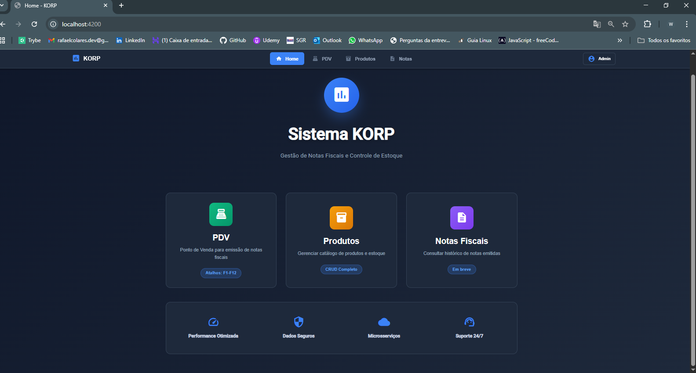
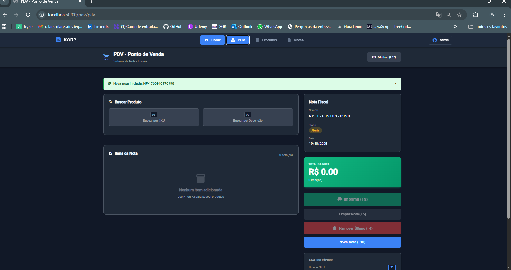
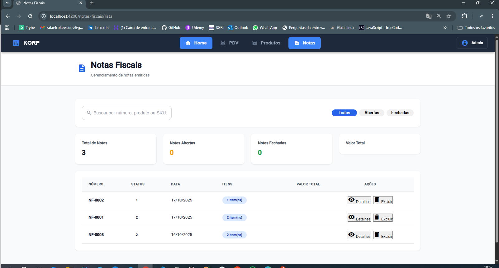

# 🧾 Sistema KORP — Desafio Técnico

## 1. Visão Geral e Propósito
O **Sistema KORP** é uma solução corporativa para **gestão de notas fiscais e controle de estoque**, desenvolvida com **arquitetura de microsserviços**.  
O projeto demonstra práticas modernas de engenharia de software, com foco em **escalabilidade, resiliência, governança de design e experiência do usuário**.

A aplicação segue princípios de desenvolvimento:
- **SOLID**, **DRY** e **Clean Architecture**
- **Design System** e **Acessibilidade (WCAG)**
- **Segurança (OWASP Top 10)**
- **Resiliência e Idempotência**

---

## 2. Arquitetura de Software

### 🧩 2.1 Estrutura Principal
```
src/
  Backend/
    EstoqueService/
    FaturamentoService/
  Frontend/
    korp-frontend/
```

- **Backend:**  
  - `EstoqueService`: gerencia produtos, movimentações e saldo de estoque.  
  - `FaturamentoService`: gerencia notas fiscais e integração com estoque.  
- **Frontend:** Aplicação Angular moderna e responsiva.  
- **Infraestrutura:** SQL Server, Docker, Entity Framework Core e Swagger/OpenAPI.

---

## 3. Configuração de Banco de Dados e Connection Strings

### ⚙️ 3.1 Configuração com User Secrets (.NET)
Cada microsserviço possui sua própria base e configuração de conexão.  
Para manter as credenciais seguras, usamos o **.NET Secret Manager**.

#### 🗂️ EstoqueService
```bash
cd src/Backend/EstoqueService
dotnet user-secrets init
dotnet user-secrets set "ConnectionStrings:DefaultConnection" "Server=SEU_SERVIDOR;Database=KorpEstoqueDB;User Id=USUARIO;Password=SENHA;TrustServerCertificate=True"
```

#### 🗂️ FaturamentoService
```bash
cd src/Backend/FaturamentoService
dotnet user-secrets init
dotnet user-secrets set "ConnectionStrings:DefaultConnection" "Server=SEU_SERVIDOR;Database=KorpEstoqueDB;User Id=USUARIO;Password=SENHA;TrustServerCertificate=True"
```

> 💡 **Dica:** o comando `dotnet user-secrets list` permite verificar a configuração atual.

### 🧩 3.2 Uso no código (.NET)
`Program.cs` de cada projeto:
```csharp
builder.Services.AddDbContext<AppDbContext>(options =>
    options.UseSqlServer(builder.Configuration.GetConnectionString("DefaultConnection")));
```

### 🐳 3.3 Connection String no Docker
Para uso via Docker, defina as variáveis de ambiente no `docker-compose.yml`:
```yaml
services:
  estoque-service:
    environment:
      - ConnectionStrings__DefaultConnection=Server=db;Database=KorpEstoqueDB;User Id=sa;Password=pegasusnow;TrustServerCertificate=True

  faturamento-service:
    environment:
      - ConnectionStrings__DefaultConnection=Server=db;Database=KorpFaturamentoDB;User Id=sa;Password=pegasusnow;TrustServerCertificate=True
```

---

## 4. Escopo Atendido — ✅ Desafio Resolvido

### 📦 Cadastro de Produtos
- Cadastrar produtos com descrição, SKU e preço.
- Controle de saldo e movimentações de estoque.

### 🧾 Cadastro de Notas Fiscais
- Criar notas fiscais com status (Aberta/Fechada).  
- Associar múltiplos produtos cadastrados.

### 🖨️ Impressão de Notas
- Impressão apenas se o saldo for suficiente.  
- Atualiza o estoque e altera o status para “Fechada”.  
- Exibe feedback detalhado ao usuário.

---

## 5. Estrutura de Microsserviços

### 🧱 EstoqueService
- CRUD de produtos.  
- Atualização de saldo.  
- API RESTful com endpoints seguros.

### 🧩 FaturamentoService
- Gerencia notas fiscais e emissão.  
- Comunicação via HTTP com EstoqueService.  
- Implementação de políticas de resiliência com *Polly*.

### 🔗 Comunicação
- REST API JSON entre microsserviços.  
- Retornos padronizados e tratados com clareza.  
- Logs e rastreabilidade em todas as transações.

---

## 6. Frontend (Angular)

### 🎨 Interface Visual
- Telas para produtos, notas fiscais e impressão.  
- Feedback em tempo real, alertas e loaders.  
- Responsividade e acessibilidade WCAG.

### 🧠 Design System
- Componentes reutilizáveis (botões, tabelas, modais, inputs).  
- Tailwind CSS + boas práticas Angular 18.

### 📍 Estrutura
```
korp-frontend/
  src/
    app/
      core/
      shared/
      features/
      layout/
```

---

## 7. Execução do Projeto

### 🧩 Backend
```bash
cd src/Backend/EstoqueService
dotnet run

cd ../FaturamentoService
dotnet run
```

### 💻 Frontend
```bash
cd src/Frontend/korp-frontend
npm install
ng serve
```
Acesse: 👉 http://localhost:4200

### 🔍 Swagger
- EstoqueService → http://localhost:5001/swagger  
- FaturamentoService → http://localhost:5002/swagger  

---

## 🎨 Interface Visual (Frontend Angular)

### 🏠 Tela Inicial


### 💳 PDV - Ponto de Venda


### 📦 Produtos


### 🧾 Notas Fiscais


---

## 8. Tecnologias Principais
| Camada | Tecnologias |
|--------|--------------|
| Backend | .NET 8, Entity Framework Core, Swagger, Polly |
| Frontend | Angular 18, TypeScript, Tailwind CSS, Shadcn UI |
| Banco | SQL Server |
| Infra | Docker, Docker Compose |

---

## 9. Boas Práticas Implementadas
- Arquitetura em camadas e princípios SOLID.  
- Tratamento de erros e respostas amigáveis.  
- Logs estruturados e centralizados.  
- Segurança de credenciais com *user-secrets*.  
- Frontend escalável e acessível.

---

## 👨‍💻 Autor
**Rafael Colares**  
Desenvolvedor Full Stack • .NET • Angular • SQL Server  
📧 [rafaelcolares.dev@gmail.com](mailto:rafaelcolares.dev@gmail.com)  
🔗 [LinkedIn](https://www.linkedin.com/in/rafael-colares/)
